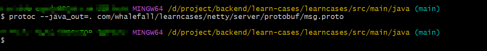

== compile protobuf

[source,shell]
----
# MINGW64 /d/project/backend/learn-cases/learncases/src/main/java (main)
cd /d/project/backend/learn-cases/learncases/src/main/java

protoc --java_out=. com/whalefall/learncases/netty/server/protobuf/msg.proto
----

